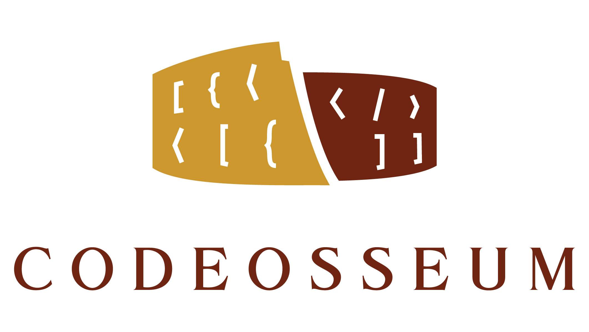

  

Quaestiones: Challenge database for Codeosseum.

# Quaestiones

## License

Quaestiones is licensed under the [Apache License 2.0](LICENSE).

## Acknowledgements

  

    Supported by the ÚNKP-18-2 New National Excellence Program of the Ministry of Human Capacities.

